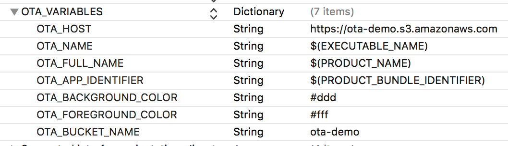

# Over the Air

This is an experimental project meant to use a Swift script to automatically update template files for use for OTA deployments with an AWS S3 bucket. A manifest, web page and bucket policy are updated using variables set in the Info.plist for the project so that the values are kept current for OTA deployments.

Over the Air deployments work with a file manifest which is opened with a URL Scheme which triggers the OTA installation process on iOS devices. In the `template` folder there are templates named `manifest.plist`, `install.html` and `bucket-policy.json` which include placeholder values which are replaced using `prepare_ota.swift` which uses variables set in the Info.plist.

Currently the script can be run using the shell script `prepare_ota.sh` but it should be run from an Xcode build process. By running it using `xcrun --sdk macosx swift` it runs the script for macOS instead of iOS which runs it in a different mode.

## AWS S3

With these files it is possible to create a bucket on AWS S3 and set the policy with the updated `bucket-policy.json` to make these files publicly accessible. The web page and manifest should then be placed in the bucket. With Xcode you can create an archive which results in a .ipa file which should also be placed in the bucket with the name which matches the project name which is set in the manifest. Then you can point your iOS device to the web page and tap the install button. It will load the manifest and then discover the .ipa file and initiate the installation process.

## Why Swift?

Shell scripts are quite powerful but also limited compared to Swift. By using Swift it may make some automated tasks more approachable so that more automation can be integrated with the build system. The process of replacing placeholder values in the template files might be possible with just a shell script but it is much easier with Swift. And by loading the Swift script as an independent file in an Xcode Workspace outside of the iOS project which uses it allows for editing it within Xcode with syntax support and static checking. The process of working with large, complex shell scripts does not offer the same development features.

---

Brennan Stehling - 2016
